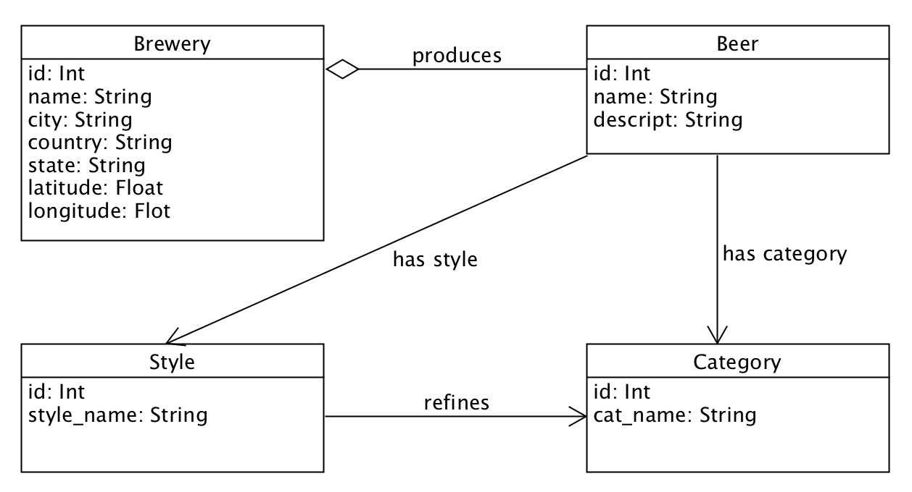
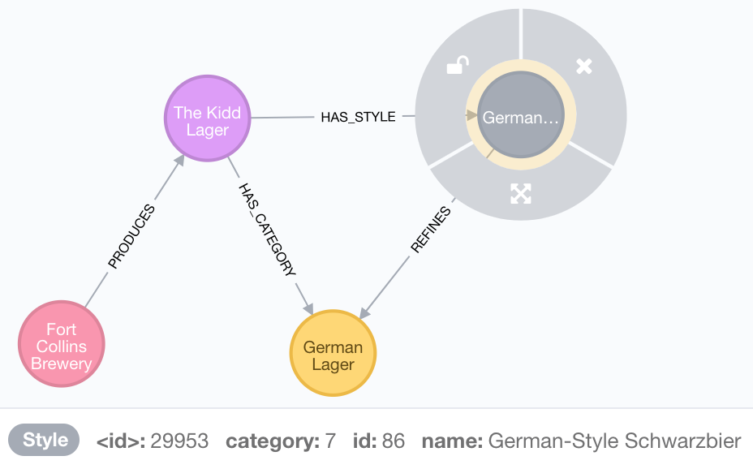
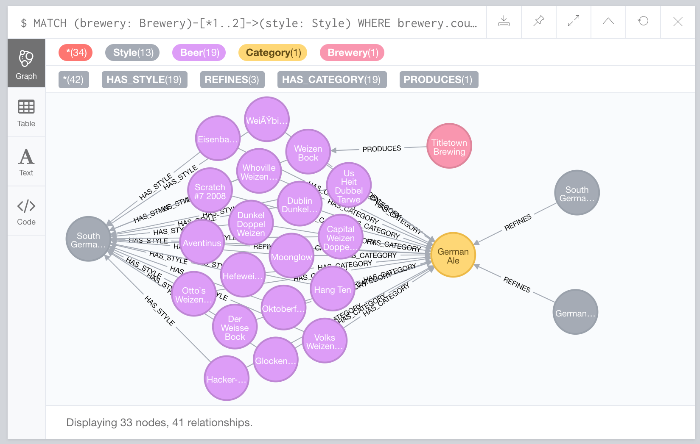
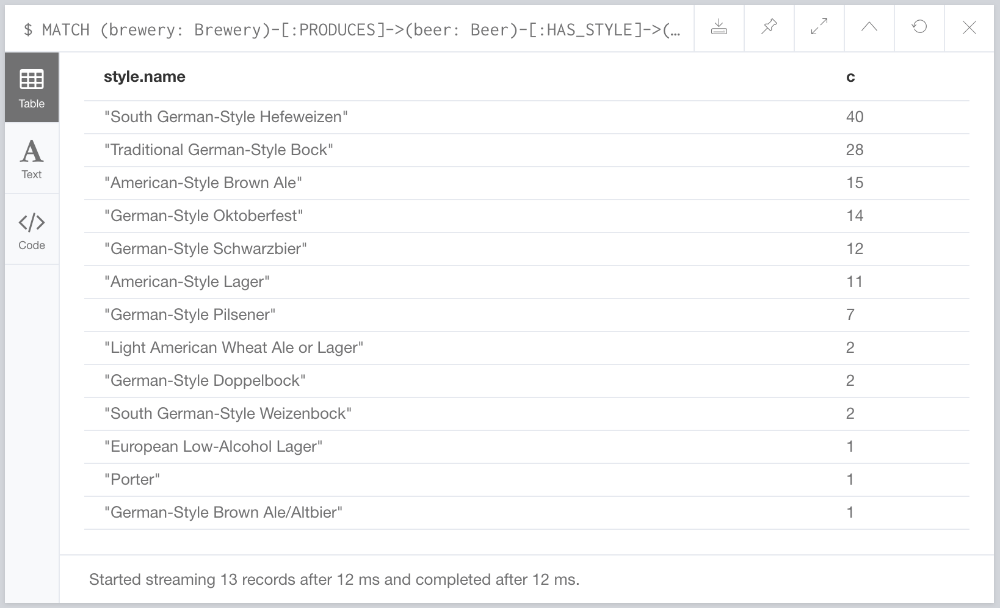

# The neo4j beer demo
Hey, this is my interpretation of the neo4j beer demo. I got some inspiration from [this blog post](https://neo4j.com/blog/fun-with-beer-and-graphs/). Originally this demo is included in a bigger context of a DC/OS beer demo, containing more components. Please check the [DC/OS demo](https://github.com/unterstein/dcos-beer-demo).

## The domain
In this demo we are talking all about beer. There is this old website [openbeerdb.com](https://openbeerdb.com) and they offer a quite old list of beer, breweries, beer categories and beer styles as downloadable sql files. But age doesn't matter for this demo, as long as you are old enough to drink.
You can find this sql files and the related readme in the `database/sql` folder. This database contains a list of around 1500 breweries and 6000 different beers with their relation to category and style. You can see the model and important properties in the diagram below:

## Extract rich data to Neo4j
### Install Neo4j
To install a proper Neo4j [causal cluster](http://neo4j.com/docs/operations-manual/current/clustering/causal-clustering/), simply run `dcos package install neo4j`. This will install a Neo4j cluster of 3 Neo4j core nodes. If you want to access your Neo4j cluster from the outside of your DC/OS cluster, you will need to install the `neo4j-proxy` package additionally. DC/OS is designed to run applications internally on private nodes by default.

### The migration job
In order to migrate the database from Mysql to Neo4j, we need to run a migration. In DC/OS we have the possibility to run one time or scheduled jobs in the jobs section. Simply run `dcos job add migration-configuration.json` (TODO ADD) to add the job and `dcos job run migration` to execute it once.

## Query connected data
After the job finished execution, we can see the result of our enriched and connected data. If you point your browser to https://publicIp:7474, you login to Neo4j with the default credentials `neo4j:dcos`. The graph model looks like this:

The special thing about graphs are, that hops between nodes are native database concepts and way cheaper than joins in relation databases. In Neo4j you can query patterns of node-relation combination. For example a query like this `MATCH (brewery: Brewery)-[*1..2]->(style: Style) WHERE brewery.country = "Germany" WITH style, count(*) as c RETURN style, c;` would return all breweries from germany which has a relation over maximum 2 hops to a style of beer. If you pick one of the resulting nodes and double click to expand relations, you might be lucky and get a result like this:

If you go for a more text based result, you could run `MATCH (brewery: Brewery)-[:PRODUCES]->(beer: Beer)-[:HAS_STYLE]->(style: Style) WHERE brewery.country = "Germany" WITH style, count(beer) as c ORDER BY c DESC RETURN style.name, c;` and get the following result:

So, we see the germany like to produce and probably to drink `South German-Style Hefeweizen`. We could re-run this query with `WHERE brewery.country = "United States"`, but well...there is no good american beer anyways ;-).

# Data from openbeerdb.com
All sql files are downloaded from https://openbeerdb.com/ and they are under the Open Database License: http://opendatacommons.org/licenses/odbl/1.0/